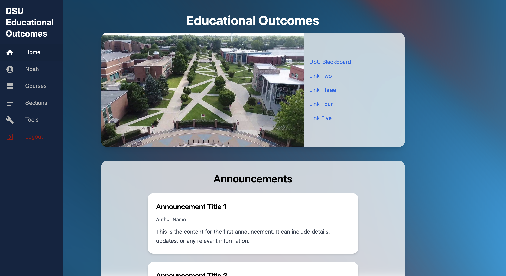

# Educational Outcomes Web Application

# Purpose
### The purpose of this application is to provide educators at Delaware State University with an application where they can upload their grades, map the questions to ABET learning outcomes and then automatically receive information on their student performance on the aforementioned learning outcomes. This will also include statistical analysis to some degree for insightful information
 

# To Do List:
- Finish Frontend Programming
- Add Announcements model to the backend to make the home page's announcement section dynamic
- Add navigational buttons when you go fine-grain into course -> section -> evaluation instrument to make backtracking easier
 

# Home Page Preview 

# Courses Page Preview 

# Specific Course Page Preview 

# CLO Mappings For Courses Preview 

 

# Database Schema 

# Initial Setup Required
1. ### Must have Python 3.11.9 & corresponding Python Virtual Environment called 'env' within the parent directory.
2. ### Must have Node.js installed.
 

# Installing Required Python Packages for Local Development
1. Install Python version 3.11.9 (and assign it to your PATH in environment variables if on Windows, if not already done automatically)
  
2. Ensure you are in main git directory (same level as your virtual environment)
  
3. If you don't already have a Python 3.11.9 virtual environment, perform the following command to instantiate it:  
`python -m venv env`
  This will instantiate a Python virtual environment called 'env'. DO NOT NAME IT 'venv', name it 'env'.  

5. Now that you have a Python virtual environment, you must activate it before installing packages.  

For UNIX OS':  
`source env/bin/activate`  

And this command for Windows OS:  
`.\env\Scripts\activate`

 

6. Perform the following command to install all required Python packages:  
`pip install -r requirements.txt`

  

# Installing Required Node Packages for Local Development
1. Ensure you have Node.js downloaded and installed. On Windows, ensure that it is added to the PATH Environment Variables. On UNIX, this should be automatically handled.
  
2. Change directory into the 'frontend' directory and perform the following command: 
`npm install` or `npm i`

  
This will automatically download all required Node JS packages.
  
4. NOTE: This project was set up specifically for UNIX or UNIX-like OS'. Due to the way React JS handles explicit imports differently on differing OS', you MUST swap the contents of the Tailwind CSS configuration file in the frontend directory. Other than that, you should not run into any issues that are not explicity mentioned in this document.
  

# Starting up Local Development Server
1. Ensure you are on the desired git branch (typically you should make a new branch for every feature).
  
2. Open a terminal on VS code (or other terminal)
  
3. Hit the split terminal button on VS code so that you have two terminal windows that are side by side
  
### Frontend Server
4. On the left terminal, change directory into the 'frontend' directory and perform the following command: 
`npm run dev`

  
This will, in turn, start up the Node JS development server. Use the provided local network link to view the output of the Node JS frontend server.
  
### Backend Server
5. On the right aforementioned terminal window, change directories into the 'backend' directory. Ensure that the python virtual environment is activated (if not, use steps listed in previous sections to activate it). Then, perform the following command to startup the backend Django server: 
`python manage.py runserver`

  

# Database Setup
- Due to the way I set up the database and the gitignore while developing, the entire database will be wholly empty and non-migrated when you start up for the first time after cloning this repo.
- Because of this, you will have to use Django's shell using the following command in order to manually add the required UserRole model entries used for tracking user roles:
1. Create and activate your Python virtual environment (see above for help)
2. Navigate to the backend directory
3. Run this command to open Django's shell: 
`python manage.py shell`

 
4. Run this command to import the model:
 
`from api.models import UserRole`
5. Run this series of commands and select the 'Paste' option if prompted in order to add the correct entries (the permissions attribute is not currently used well, bear with me):
 

`UserRole.objects.create(` 
    `role_name='root',` 
    `role_description='Super administrator with full access',` 
    `permissions='root'` 
`)` 
`UserRole.objects.create(` 
    `role_name='Admin',` 
    `role_description='Administrator with high-level permissions',` 
    `permissions='Admin'` 
`)` 
`UserRole.objects.create(` 
    `role_name='User',` 
    `role_description='General user with limited permissions',` 
    `permissions='User'` 
`)` 

# Tutorial Used
https://www.youtube.com/watch?v=c-QsfbznSXI&t=3487s

# Note from Author
The content of this project may not be copied or re-used in any way without explicity written (or typed) permission from me. This project was created using a webapp template I created under Sage Advisory DE LLC, all rights reserved. Special permission has been given for the faculty and staff at DSU to use this webapp as a tool for the further of education and therefore is free for them to use, modify, and/or change in any way that they may need to in the future. They are also free to claim it as theirs, and license it as they wish for commercial, educational, or any other use.
